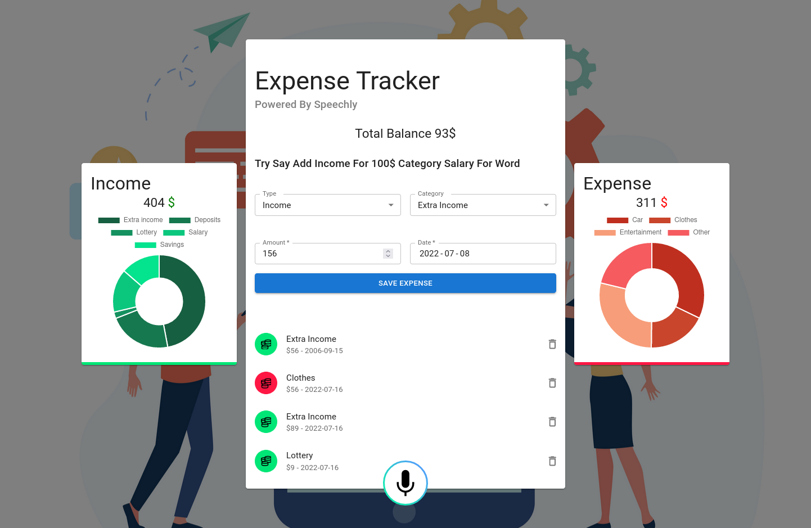

# Getting Started with Speechly

## Used Tools

- [`Material UI`](https://mui.com/)
- [`Redux-Toolkit`](https://redux-toolkit.js.org/)
- [`Speechly`](https://www.speechly.com/)
- [`Chart.js`](https://www.chartjs.org/)
- [`React-Icons`](https://react-icons.github.io/react-icons)
- [`React-Redux`](https://react-redux.js.org/)
- [`SASS`](https://sass-lang.com/)
- [`UUID`](https://www.npmjs.com/package/uuid)

## Upcoming Features

- More Handel With Voice Words Detections
